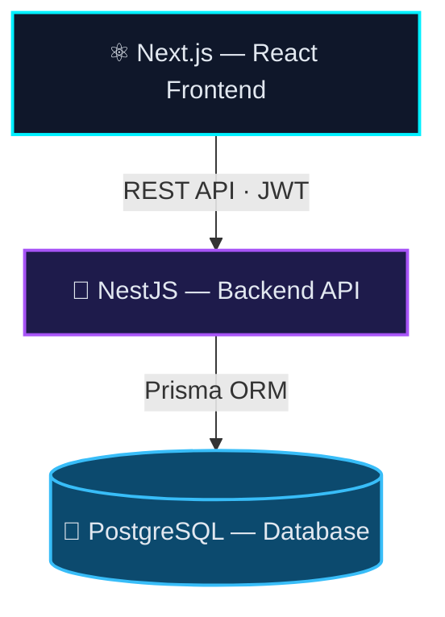

<div align="center">


<a href="https://github.com/afrid49">
  
</a>

<br/>

**Building modern web applications with strong backend architecture, clean APIs, and practical user experiences.**

<br/>

<a href="https://github.com/afrid49"></a>
<a href="https://www.linkedin.com/in/md-afrid-6a388b381/"></a>
<a href="mailto:md.afrid4849@gmail.com"></a>

<br/><br/>


</div>


I'm a **CSE graduate from American International University-Bangladesh (AIUB)** focused on **full-stack and backend development**.

I enjoy turning ideas into complete software systems — from database design and REST APIs to responsive frontend interfaces and authentication workflows.

I recently worked as a **Software Engineer Intern at XR Interactive**, where I contributed to **EventX**, a full-stack event management platform built with **Next.js, NestJS, PostgreSQL, and Prisma**.

```yaml
🎓 degree:         BSc in Computer Science & Engineering — AIUB
📅 examinations:   University examinations completed — September 2026
💼 experience:     Software Engineer Intern — XR Interactive
🚀 building:       EventX — Full-Stack Event Management Platform
🧩 interested_in:  Backend Engineering · Full-Stack Development · System Design
🔬 research:       Machine Learning & Human–Computer Interaction
📍 location:       Bangladesh
```


### ◆ Software Engineer Intern — XR Interactive
**Full-Stack Development · EventX**

Worked on the development of a full-stack event management platform covering:

<table>
<tr>
<td width="50%" valign="top">

`▸` RESTful backend APIs with **NestJS**
<br/>`▸` Modern frontend development with **Next.js & React**
<br/>`▸` **TypeScript** application development
<br/>`▸` **Node.js** backend development
<br/>`▸` PostgreSQL database architecture
<br/>`▸` Prisma ORM and database migrations
<br/>`▸` JWT-based authentication
<br/>`▸` Role-based access control

</td>
<td width="50%" valign="top">

`▸` Organization and membership management
<br/>`▸` Event creation, editing and management
<br/>`▸` Participant registration
<br/>`▸` Individual QR-code check-in
<br/>`▸` Event feedback system
<br/>`▸` Certificate management
<br/>`▸` API testing and debugging
<br/>`▸` Git-based development workflow

</td>
</tr>
</table>


<div align="center">


### Full-Stack Event Management Platform

**Next.js · React · TypeScript · NestJS · Node.js · PostgreSQL · Prisma · JWT**


<br/><br/>

<a href="https://github.com/afrid49/EventX"></a>

</div>

EventX is a full-stack platform designed to manage the complete lifecycle of events — from organization and event creation to participant registration, QR-based attendance, feedback, and certificates.

### Core Features

| Area | Features |
| :-- | :-- |
| 🔐 **Authentication** | Registration · Login · JWT |
| 👥 **Organizations** | Members · Roles · Permissions |
| 📅 **Events** | Create · Edit · Delete · Publish · Manage |
| 🎟️ **Registration** | Participant registration · Status tracking |
| 📱 **Check-in** | Individual QR-based attendance |
| ⭐ **Feedback** | Post-attendance ratings & comments |
| 🏆 **Certificates** | Certificate management |
| 🛡️ **Security** | Role-based access control |
| 🗄️ **Database** | PostgreSQL + Prisma |

### Architecture




<div align="center">

### Attention-Enhanced BiLSTM Autoencoder for ECG Anomaly Detection

Research focused on applying deep learning techniques for ECG anomaly detection using an **attention-enhanced BiLSTM autoencoder architecture**.

**Published on IEEE Xplore**

<a href="https://ieeexplore.ieee.org/document/11661859"></a>

</div>


<div align="center">

**Languages**<br/>


**Frontend**<br/>


**Backend & APIs**<br/>


**Databases & ORM**<br/>


**Data & Machine Learning**<br/>


**Desktop Development**<br/>


**Tools & Development**<br/>


**Hardware & HCI**<br/>


</div>


<table>
<tr>
<td width="50%" valign="top">

### 🏫 School Management System
**C# · .NET · Windows Forms · SQL Server · LocalDB**

Desktop-based management system with role-based authentication and separate workflows for administrators, teachers, students, and medical staff.

<a href="https://github.com/afrid49/SchoolManagementSystem-C-project"></a>

</td>
<td width="50%" valign="top">

### 🧠 ECG Anomaly Detection
**Python · Machine Learning · BiLSTM · Autoencoder**

Attention-enhanced BiLSTM autoencoder research project for detecting anomalies in ECG signals.

<a href="https://github.com/afrid49/ML_anomoly_machine"></a>

</td>
</tr>
<tr>
<td width="50%" valign="top">

### 🎫 Bus Ticket Management System
**Java · OOP · File/Data Management**

Java-based ticket management application demonstrating object-oriented programming and application-level data handling.

<a href="https://github.com/afrid49/bus-ticket-management-system-Java-project"></a>

</td>
<td width="50%" valign="top">

### 🔊 Audio Amplifier Device
**Electronics · Circuit Design · Hardware**

Hardware project focused on designing and implementing an audio amplification system.

<a href="https://github.com/afrid49/Audio-Amplifier-Device-project"></a>

</td>
</tr>
</table>


```text
Languages       →  C · C++ · C# · Java · JavaScript · TypeScript · Python · PHP · SQL
Frontend        →  Next.js · React · HTML · CSS · Three.js
Backend         →  NestJS · Node.js · .NET · REST APIs
Database        →  PostgreSQL · MySQL · SQL Server · LocalDB · Prisma
Authentication  →  JWT · RBAC
ML / Data       →  Python · NumPy · Pandas · Scikit-learn · BiLSTM · Autoencoders
Desktop         →  C# · .NET · Windows Forms
Tools           →  Git · GitHub · Postman · VS Code · pgAdmin
HCI / IoT       →  Arduino · Hall Sensors · MPU6050 · LCD · Embedded Systems
```


<div align="center">


<br/>


<br/>


</div>


```text
01  Full-Stack Engineering
02  Backend Architecture
03  REST API Design
04  Database Design
05  Authentication & Authorization
06  System Design
07  Clean & Maintainable Code
```

I'm particularly interested in opportunities where I can contribute to **real software products**, strengthen my engineering skills, and continue growing across the full development lifecycle.

<div align="center">

<br/>

## Let's Build Something Useful.

**Software Engineering · Full-Stack Development · Backend Engineering**

<br/>

<a href="mailto:md.afrid4849@gmail.com"></a>
<a href="https://www.linkedin.com/in/md-afrid-6a388b381/"></a>


</div>
